# BRZ Garage

**为 Subaru BRZ 打造的圆形 OBD 仪表与本地行程管家**

ESP32-S3 · 1.75 英寸 AMOLED · BLE ELM327 · Android

[](https://docs.espressif.com/projects/esp-idf/)
[](CHANGELOG.md)
[](https://github.com/sisi4376/BRZ-Garage/releases/download/v3.2.20/BRZ-Garage-v3.2.20-debug.apk)
[](#早期测试版说明)
[](LICENSE)

[下载 Android App](https://github.com/sisi4376/BRZ-Garage/releases) ·
<!---
# [查看更新日志](CHANGELOG.md)
-->

## 早期测试版说明

> [!WARNING]
> **BRZ Garage 目前仍是早期测试版//烧录调试仪表建议有一定的代码基础//AI Agent能够高效协助您完成烧录。** 功能、界面、通信协议和本地数据结构仍可能调整；不同年款、市场版本、ECU 软件与 ELM327 适配器尚未全部验证。请在停车状态下完成配置与固件更新，并在升级前保留重要数据。仪表读数和推算结果仅供驾驶参考，不能替代原厂仪表或专业诊断设备。
> 
> ❌ **目前只支持MT版本，暂不支持AT版本**
>
> ❌**目前仪表需要APP授时，每次启动车辆后需要检查仪表状态，APP后台不稳定时可能导致行程缺失（可能需要手动开启APP）**
> 
> APP开发过程中仅在鸿蒙6系统进行过测试，安卓兼容性尚且未知（应该不会有大问题）。❌ **暂不支持IOS。**

## 现有问题
> 转速表和车速表运行时目前仍有一定的卡顿
> 
> APP后台自动唤醒功能仍不稳定，可能导致仪表授时失败，从而导致行程时间缺失。
> 

## 这是什么？

**BRZ Garage** 是一套由圆形 AMOLED 仪表和 Android App 组成的开源 BRZ 车载数据方案。仪表通过 BLE 连接 ELM327，从车辆读取转速、车速和温度等 OBD-II 数据；手机负责自动授时、车型和亮度设置、行程同步、加油记录以及无线固件更新。

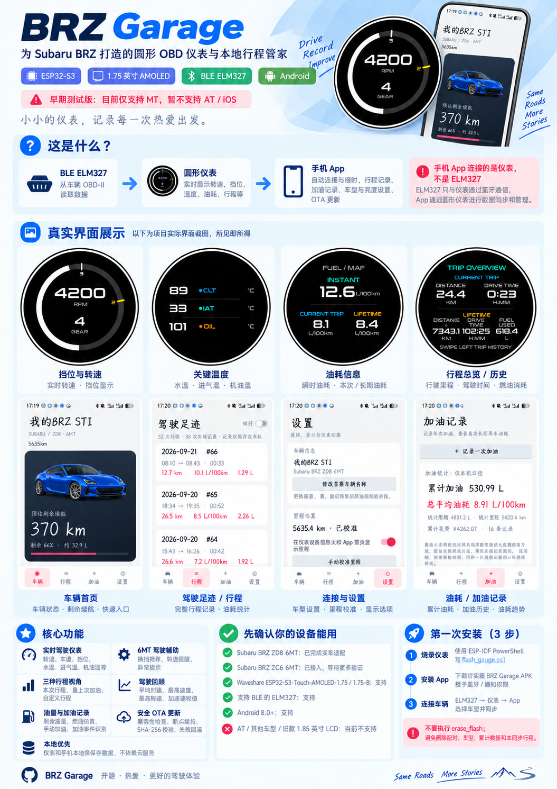

(概念图由AI生成)


<details>
<summary>架构图（点击查看详情）</summary>
    
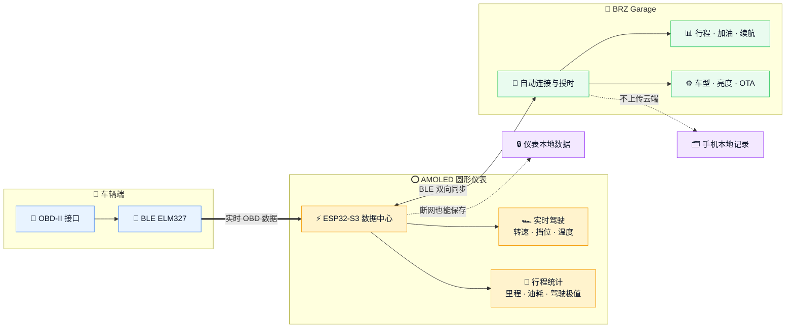

</details>

> [!IMPORTANT]
> 手机 App 连接的是**仪表**，不是 ELM327。普通 BLE ELM327 通常只允许一个客户端，使用仪表时不要再让 Car Scanner 等 App 同时直连同一个适配器。

## 先确认你的设备能用

| 项目 | 当前要求 | 支持状态 |
|---|---|---|
| 车辆 | Subaru BRZ ZD8 6MT | ✅ 已完成实车适配 |
| 车辆 | Subaru BRZ ZC6 6MT | 🧪 已接入，等待更多实车验证 |
| 仪表开发板 | Waveshare ESP32-S3-Touch-AMOLED-1.75 / 1.75-B，466×466，16 MB Flash，8 MB PSRAM | ✅ 支持 |
| OBD 适配器 | 支持 BLE 的 ELM327 兼容设备 | ✅ 支持，品质会影响稳定性 |
| 手机 | Android 8.0 或更高版本 | ✅ 支持 |
| 自动挡、其他车型、旧款 1.85 英寸 LCD | — | ❌ 当前用户版不支持 |

如果你的硬件或车型不在表中，请不要直接烧录。源码中保留的历史板型和其他车辆配置，不代表当前版本已经开放或验证。

## 仪表界面

| 挡位与转速 | 关键温度 | 油耗信息 |
|:---:|:---:|:---:|
| 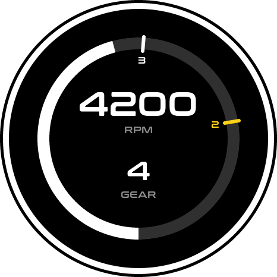 | 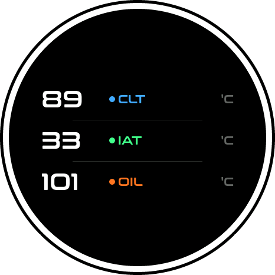 | 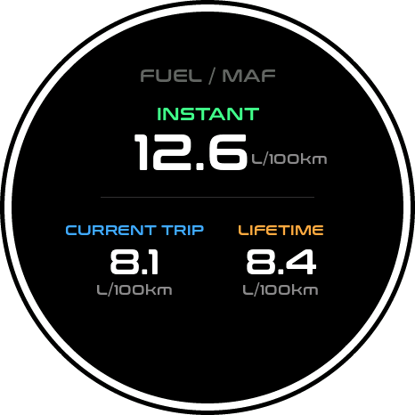 |
| 转速提醒、挡位推算(仅模拟示意，挡位关系有错误) | 水温、进气温、机油温 | 瞬时、本次与累计油耗 |
| **行程总览** | **历史行程** | **转速提醒** |
| 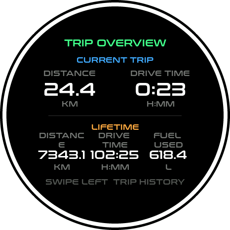 | 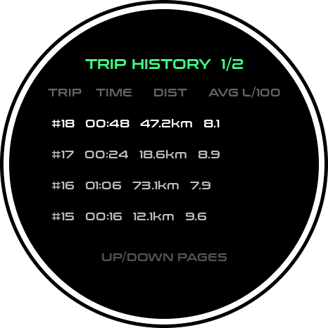 | 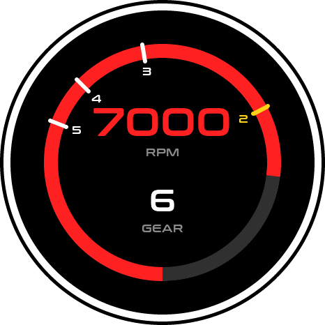 |
| 里程、时间、累计燃油 | 本地保存，断点同步到手机 | 超过阈值时醒目闪烁(仅模拟示意，挡位关系有错误) |

> 上图由项目自己的 LVGL 模拟器渲染，使用的页面代码和字体资源与固件相同；数值为演示数据。

## App 界面预览

| 车辆首页 | 当前驾驶 | 驾驶足迹 |
|:---:|:---:|:---:|
| 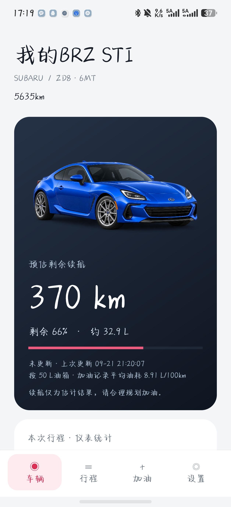 | 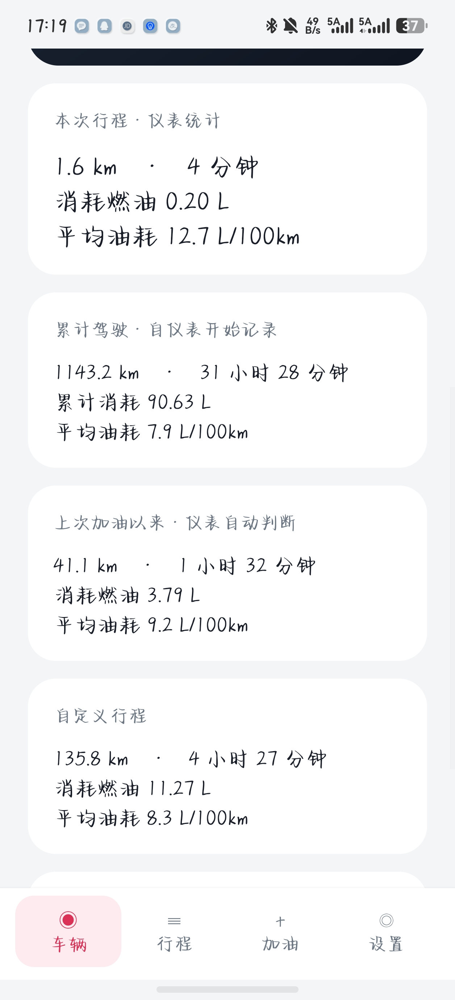 | 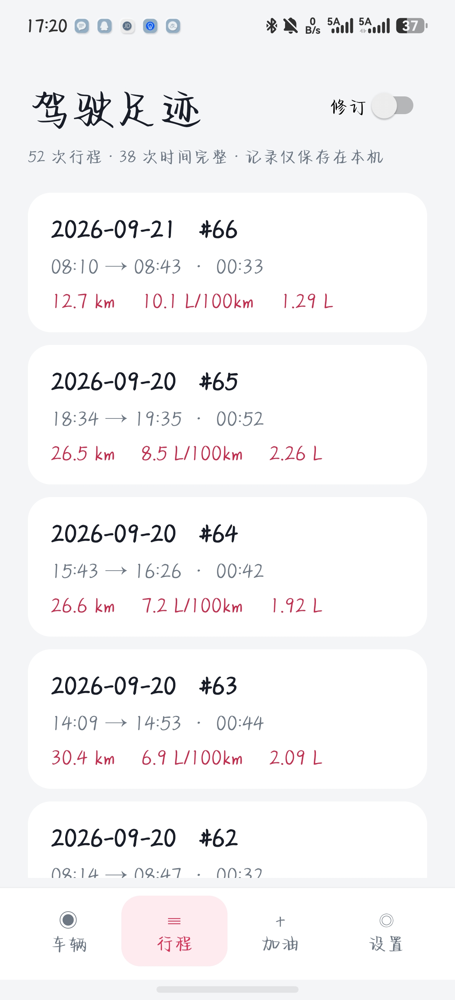 |
| 主页：里程与续航 | 主页：当前行程 | 历史行程 |

| 驾驶详情 | 加油记录 | 设置 |
|:---:|:---:|:---:|
| 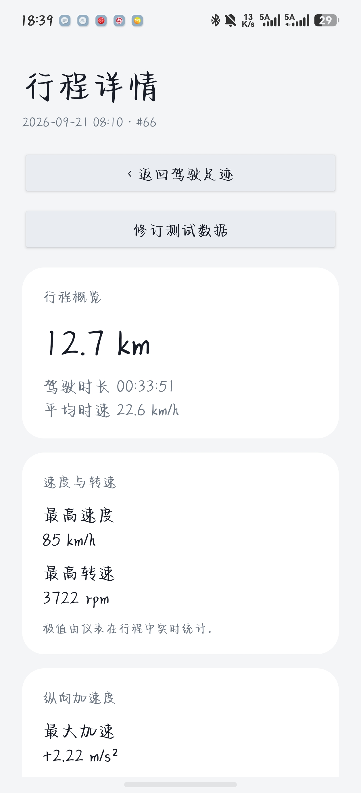 | 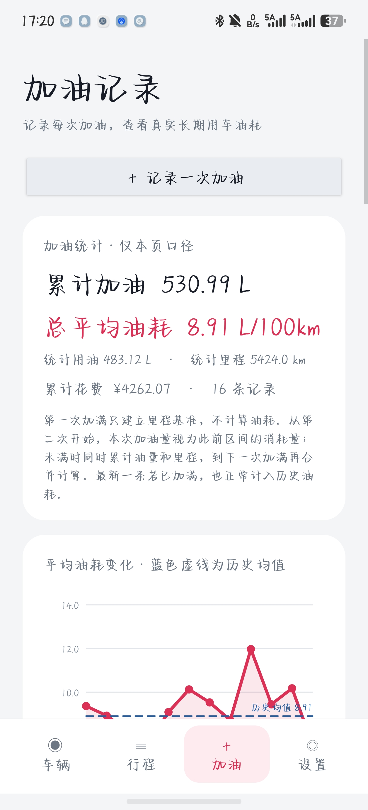 | 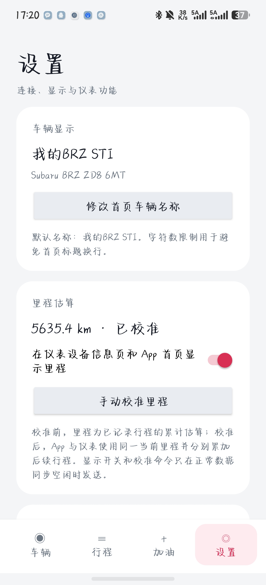 |
| 历史行程详情 | 加油记录 | 车辆、仪表与 OTA 管理 |

> App 预览依据当前 Android 页面结构绘制，使用演示车辆与行程数据；不同系统版本、屏幕尺寸和连接状态下的实际布局与内容可能略有差异。

## 功能全景

| 功能 | 你能获得什么 |
|---|---|
| 🏎️ **实时驾驶仪表** | 显示转速、车速、挡位、水温、进气温、机油温、发动机负荷、节气门、电压和机油压力等关键数据。圆形页面适合快速扫视，左右滑动即可切换。 |
| 🎯 **6MT 驾驶辅助** | 根据转速与车速推算当前挡位；转速超过自定义阈值时以高对比动画提醒，OBD 或授时链路异常时也会在仪表上明确显示。 |
| 🌡️ **温度与状态监控** | 把水温、进气温和机油温集中在同一页面，也可使用指针或曲线页面观察指定数据的变化趋势。 |
| 🧭 **三种行程视角** | 同时记录“本次行程”“自上次加油”和“自定义行程”的里程、驾驶时间与耗油量；自定义基线同步到仪表后，手机断开也能继续统计。 |
| 🏁 **驾驶回顾** | 每次行程可查看平均时速、最高速度、最高转速、最大加速/减速、平均油耗、燃油消耗和起止时间；旧记录与缺失数据会明确标注，不伪造数值。 |
| ⛽ **油量、续航与加油记录** | App 显示剩余油量和估算续航，支持手动加油记录；仪表还能通过两次独立油位样本识别加油事件，识别阈值可在 **5～20 L** 间调节。 |
| 📱 **自动连接与后台同步** | 绑定后可由系统 BLE 唤醒 App，优先为仪表授时，再同步车辆快照和历史行程；驾驶时常驻通知会直接显示时长与已行驶里程。 |
| 🎛️ **手机端车辆管理** | 在 App 中切换 ZD8/ZC6、调整 10%～100% 日间亮度、校准车辆里程、控制首页卡片，并把设置发送到仪表后回读确认。 |
| 🔄 **安全无线更新** | App 先检查板型、屏幕、Flash 和双 OTA 分区，再通过仪表临时热点传输固件；支持断点续传、SHA-256 校验和启动失败自动回滚。 |
| 🔒 **本地优先的数据设计** | 设置、累计统计和未同步行程保存在仪表，历史行程与加油记录保存在手机；日常功能不依赖账号或云服务。 |

## 准备清单

开始前请准备：

- Waveshare ESP32-S3-Touch-AMOLED-1.75 或 1.75-B；
- 一条确认支持数据传输的 USB 线；
- BLE ELM327 兼容适配器；
- Android 8.0+ 手机；
- Windows 电脑和 [ESP-IDF 5.5+](https://docs.espressif.com/projects/esp-idf/en/latest/esp32s3/get-started/index.html)。

## 第一次安装

### 1. 烧录仪表

从开始菜单打开 **ESP-IDF PowerShell**。不要使用普通 PowerShell，因为其中通常没有配置 `idf.py` 和 `esptool.py`。

先确认工具可用：

```powershell
idf.py --version
esptool.py version
```

用 USB 连接仪表，然后查看串口：

```powershell
[System.IO.Ports.SerialPort]::GetPortNames()
```

进入项目目录，将 `COM5` 换成你的实际串口，只运行下面这条推荐命令：

```powershell
cd C:\path\to\BRZ_OBD
.\tools\flash_gauge.ps1 -Port COM5 -Board AMOLED_175
```

脚本会检查板型、备份原有配置、编译当前固件并烧录。确认屏幕上的串口和板型无误后，按提示输入大写 `FLASH`。

> [!WARNING]
> 不要运行 `erase_flash` 或 `idf.py erase-flash`。整片擦除会删除 ELM327 配对、车型、主题、累计油耗和未同步行程。推荐脚本不会执行整片擦除。

烧录成功后，仪表会自动复位并显示启动画面。配置备份保存在 `backups/manual/`，确认设备正常前请勿删除。

<details>
<summary><b>一直停在 Connecting… 怎么办？</b></summary>

1. 关闭串口监视器、IDE 和其他可能占用串口的软件。
2. 按住开发板的 `BOOT` 键。
3. 短按并松开 `RESET/RST`。
4. 松开 `BOOT`。
5. 重新执行同一条烧录命令。

</details>

### 2. 安装 BRZ Garage

前往Release页面下载并安装最新版本的 **[BRZ Garage](https://github.com/sisi4376/BRZ-Garage/releases)**。经过第一次烧录后，APP以及仪表固件的后续升级可以直接在 App 内完成。

- 覆盖安装新版 APK 即可保留历史数据，**不要先卸载旧版**；
- 授予“附近设备”、通知，以及 Android 13+ 的附近 Wi-Fi 权限；
- 如果系统提示未知来源安装，只应对从本仓库下载的 APK 临时授权；
- 华为/鸿蒙手机还需要允许自启动、关联启动和后台活动，并关闭电池优化。

### 3. 连接车辆

1. 将 ELM327 插入车辆 OBD-II 接口，启动车辆，或让 ECU 保持可响应状态。
2. 打开仪表的 BLE 扫描页，选择你自己的 ELM327。
3. 在 App 的“连接与设置”中绑定名称以 `SkyGauge` 开头的仪表。
4. 进入“仪表设置”，选择 `BRZ ZD8 6MT` 或 `BRZ ZC6 6MT`。
5. 点击“保存并同步车型”，等待 App 显示已经由仪表回读确认。
6. 回到仪表页，确认转速、车速和温度开始刷新。

> [!TIP]
> 仪表断电后需要手机重新授时。建议打开 App 的“开机自启 / 自动连接”，并确认“系统 BLE 唤醒”已经启用。

## 日常使用

仪表页面以手势切换：左右滑动浏览挡位、车速、温度、信息、指针、曲线、油耗和行程页面；部分页面上下滑动可进入对应设置。驾驶时请不要操作触摸屏。

常用功能一览：

- **实时数据**：转速、车速、水温、进气温、机油温、负荷、节气门、电压等；
- **驾驶辅助**：6MT 挡位推算、转速提醒和数据断开提示；
- **油耗与里程**：本次/累计油耗、行程里程、驾驶时间和估算里程；
- **行程回顾**：在 App 中查看历史行程及速度、转速和加减速极值；
- **车辆管理**：在 App 中切换 ZD8/ZC6、调整 10%～100% 日间亮度、校准车辆里程并记录加油；
- **本地数据**：仪表和 App 的记录保存在本机，不上传云端。

发动机停止后，若连续 **15 分钟**没有恢复有效 RPM，仪表会结束并保存当前行程；15 分钟内再次启动会继续记录为同一次行程。

## 用 App 更新仪表固件

1. 停车并保持仪表稳定供电。
2. 打开“连接与设置 → 仪表固件更新”。
3. 点击“扫描是否需要更新”。扫描只读取设备信息，不会立即更新。
4. 通过兼容性检查后，点击“手动进入 OTA 并更新”。
5. 阅读并完成二次驻车确认，等待传输、校验和自动重启。

更新时 App 会校验仪表型号、屏幕、Flash、双 OTA 分区和文件 SHA-256。传输短暂中断时会尝试断点续传；新固件无法正常启动时，引导程序会自动回滚。NVS 设置、累计统计、未同步行程和开机媒体不会被主动擦除。

> [!CAUTION]
> 固件检查和更新可能暂停 OBD 采集与行程记录。严禁在行驶中使用这些功能。

<!-- 暂时隐藏：常见问题

## 常见问题

| 现象 | 优先检查 |
|---|---|
| 找不到串口 | 更换确认支持数据的 USB 线；换 USB 口；重新插拔后比较端口列表 |
| 烧录卡在 `Connecting...` | 关闭占用串口的软件，并按上面的 BOOT/RESET 步骤进入下载模式 |
| 仪表找不到 ELM327 | 确认适配器是 BLE 而不是经典蓝牙/Wi-Fi；让车辆 ECU 保持唤醒 |
| App 找不到仪表 | 给 App“附近设备”权限；打开系统蓝牙；确认仪表已正常启动 |
| OBD 连接后没有数据 | 关闭其他直连 ELM327 的 App；重新上电；查看 [OBD 故障排查](docs/OBD_TROUBLESHOOTING.md) |
| App 无法自动重连 | 重新打开 App 一次；解除“强行停止”；允许自启动和后台活动 |
| 部分数据一直无效 | 低价 ELM327 可能缺少命令或刷新过慢；不同年款/市场 ECU 也可能存在差异 |

-->

## 当前边界

- ZD8 6MT 是目前唯一完成实车验证的车型；ZC6 6MT 已实现单路 OBD/PID 和 FA20 Toyota Mode 21 机油温度读取，但仍需要更多实车验证。
- 挡位、油耗、里程和加减速度是推算结果，只适合驾驶回顾，不能替代原厂仪表或专业诊断设备。
- MultiGauge 设置目前固定为 `MASTER / POS 1 / VIDEO`；相关页面保留，但不可修改。
- 行程合并间隔固定为 15 分钟；旧 NVS 中的其他车型会归一为 ZD8。
- App OTA 只允许硬件清单完全匹配的 AMOLED 1.75-B 仪表。
- 本项目不是安全关键设备。不要把显示结果作为维修或驾驶安全决策的唯一依据。

<!-- 暂时隐藏：更多文档

## 更多文档

| 想了解的内容 | 文档 |
|---|---|
| OBD 无数据、断线或 PID 异常 | [OBD 故障排查](docs/OBD_TROUBLESHOOTING.md) |
| 车型选择和参数 | [车辆配置](docs/VEHICLE_CONFIG.md) |
| ZD8 协议与挡位策略 | [ZD8 协议指南](docs/BRZ_ZD8_PROTOCOL_GUIDE.md) · [挡位策略](docs/BRZ_ZD8_GEAR_STRATEGY.md) |
| 油耗如何计算 | [油耗计算说明](docs/FUEL_CALCULATION.md) |
| App 与行程同步 | [App 集成](docs/APP_INTEGRATION.md) · [行程 BLE 同步](docs/TRIP_BLE_SYNC.md) |
| 不烧录预览界面 | [浏览器预览](preview/README.md) · [原生模拟器](simulator/README.md) |
| 主题制作 | [主题系统](docs/THEMING.md) · [主题模板](themes/README.md) |
| 完整版本历史 | [CHANGELOG](CHANGELOG.md) |

开发者可从 [中文技术说明](docs/README.zh-CN.md) 或 [English README](docs/README.en.md) 开始了解目录结构、模拟器、车辆协议和移植细节。

-->

## 致谢与许可

本项目基于 [steveEcode/obd_brz_gauge](https://github.com/steveEcode/obd_brz_gauge) 二次开发，该项目为本项目的仪表实现和硬件适配提供了重要基础与参考。

同时感谢 [zhaizhaitao/open_obd_dsp](https://github.com/zhaizhaitao/open_obd_dsp) 开源的原始仪表方案、[timurrrr/ft86](https://github.com/timurrrr/ft86) 整理的 FT86/BRZ CAN 资料，以及 [Hokori23](https://github.com/Hokori23) 提供的 NVS、页面刷新和 OBD 轮询性能建议。

本项目采用 [GNU General Public License v3.0](LICENSE)。允许使用、修改和分发；分发修改版本时必须继续按照 GPLv3 提供对应源代码。

```text
Copyright (C) 2024-2026 steveEcode and contributors
```
