# BRZ Garage

**为 Subaru BRZ 打造的圆形 OBD 仪表与本地用车管家**

[](https://docs.espressif.com/projects/esp-idf/)
[](CHANGELOG.md)
[](CHANGELOG.md)
[](#beta-公测版说明)
[](LICENSE)

[下载 v4.3.6 Beta 公测版](https://github.com/sisi4376/BRZ-Garage/releases/tag/v4.3.6) · [查看更新日志](CHANGELOG.md) · [提交问题反馈](https://github.com/sisi4376/BRZ-Garage/issues/new) · [第一次烧录](#准备清单) · [💰支持项目💰](https://afdian.com/a/4822y)

> ⭐ 如果这个项目对你有帮助，欢迎在 [GitHub 项目页面](https://github.com/sisi4376/BRZ-Garage) 右上角点一个 **Star**！
>
>  ➡️ 

>
> 你的支持能让更多 BRZ 车友发现这个项目，也是作者持续更新的动力。

## Beta 公测版说明

当前 **Beta 公测**版本为 Android App **4.3.6**（versionCode 146）与仪表固件 **4.0.5**。修复仪表启动时的内存不足及 OBD 连接卡顿，Trip Interval 上下翻页改为直接切换。现有用户可覆盖安装 APK，再在 App 中手动更新内置仪表固件。

> [!WARNING]
> **BRZ Garage 现处于 Beta 公测阶段。烧录和调试仪表需要一定的动手与排障能力，AI 编程助手可以协助完成构建、烧录和问题定位。** 功能、界面、通信协议和本地数据结构仍可能调整；测试版本也可能出现兼容性问题、连接失败、程序异常或数据丢失。请在停车状态下完成配置与固件更新，并提前保留重要数据。仪表读数和推算结果仅供驾驶参考，不能替代原厂仪表或专业诊断设备。有软件开发经验的用户也欢迎协助改进本项目。
>
> 使用前请特别注意：
>
> ❌ 当前仅支持 **6MT 手动挡**，暂不支持自动挡；
>
> ❌ 目前仅对 **ZD8** 完成实车验证，ZC6 尚需更多实车测试；
>
> ❌ 目前仪表断电后需要手机重新授时。使用时仍需检查授时状态；
>
> ❗ Android App 目前主要在 HarmonyOS 6 上测试，其他 Android 系统可能存在厂商兼容性差异；暂不支持 iOS；
>
> ❌ 本项目不能远程访问或控制车辆，也未实现 GPS 功能；如需为未来 GPS 扩展预留硬件，请选择 ESP32-S3-Touch-AMOLED-1.75-G；
>
> ❌ 当前不建议外接锂电，也未采用保险盒常电供电方案，以避免额外的电气与蓄电池风险；
>
> ❌ 未及时同步到手机的行程会暂存在仪表的有限容量队列中，但不应将仪表视为完整的数据备份。
>
> ❗ **（谨慎使用该功能）** 多台手机可以轮流连接同一仪表，各自维护本地同步游标； 请勿让两台手机同时修改仪表设置或执行 OTA。
>
> 如果您愿意支持项目的开发和后续维护，可以[帮忙给作者的 Codex 花费回回血💰](https://afdian.com/a/4822y)

## 免责声明

BRZ Garage 是独立的社区开源项目，与 Subaru Corporation、上游项目作者及相关硬件厂商不存在官方隶属、授权或背书关系；相关名称与商标归各自权利人所有，详见 [版权与来源声明](NOTICE.md)。本项目目前处于 Beta 公测阶段，软件、固件、文档及相关工具均按“现状”提供，不承诺数据准确性、运行稳定性或对特定车辆、适配器和手机系统的兼容性。

仪表读数、挡位与油耗推算、续航估算及保养提示仅供参考，不能替代原厂仪表、车辆用户手册或专业检测，也不应作为驾驶、维修或安全决策的唯一依据。请在使用前核对车型、硬件与供电方案，并自行评估安装、接线、烧录、升级及第三方适配器可能带来的设备损坏、蓄电池亏电、车辆异常、数据丢失等风险，提前备份重要数据。安装不得遮挡视线或影响安全气囊与车辆操控；配置、调试和更新应在安全停车状态下完成，驾驶时请勿操作设备。

在适用法律允许的范围内，且除非另有书面约定，作者、贡献者及分发者不提供明示或默示担保，并按 [GPLv3 第 15—17 条](LICENSE) 限制因使用或无法使用本项目所产生的损失责任。本声明不排除或限制适用法律规定不得排除或限制的责任，也不改变 GPLv3 赋予用户的权利。

## 已知限制

- 转速表和车速表运行时仍可能出现轻微卡顿，高转速闪烁提醒目前仍在优化；
- 后台自动唤醒受不同手机厂商的系统策略限制。现版本已加入系统 LE 配对、伴生设备关联、系统 BLE 扫描、自检和前台服务，但仍无法保证所有系统都会自动拉起 App；
- HarmonyOS 系统自动唤醒功能目前存在缺陷，需要手动开启App；
- 授时桥只负责时钟兜底。若仪表仍未显示有效时间，请手动打开 App；行程可以继续保存，但开始和结束时间可能缺失。

## 这是什么？

**BRZ Garage** 是一套由圆形 AMOLED 仪表和 Android App 组成的开源 BRZ 车载数据方案。仪表通过 BLE 连接 ELM327，从车辆读取转速、车速和温度等 OBD-II 数据；手机负责自动授时、车型和亮度设置、行程同步，并在本地管理加油、保养、维修与日常花费，也可安全地为仪表执行无线固件更新。

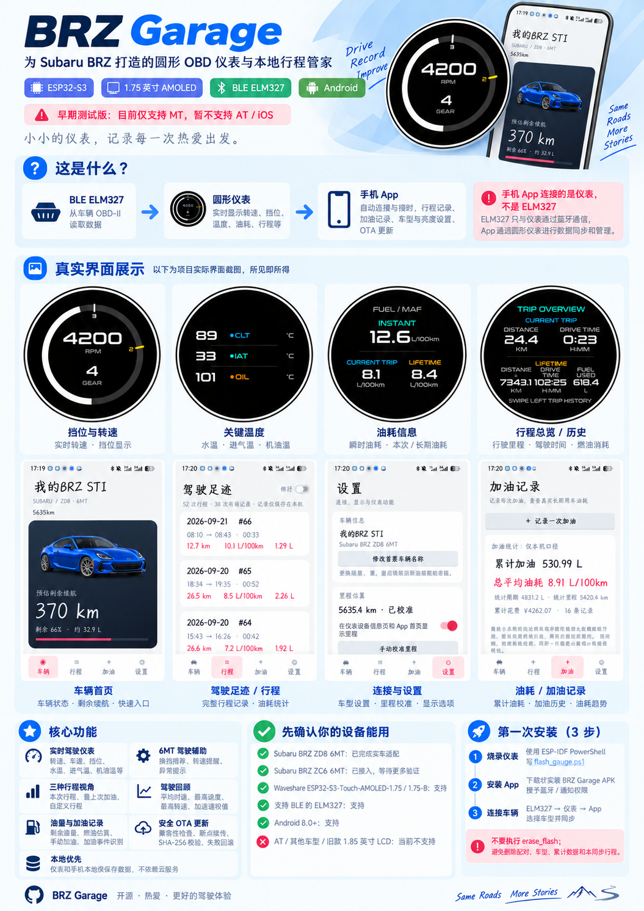

(概念图由AI生成)


<details>
<summary>架构图（点击查看详情）</summary>
    
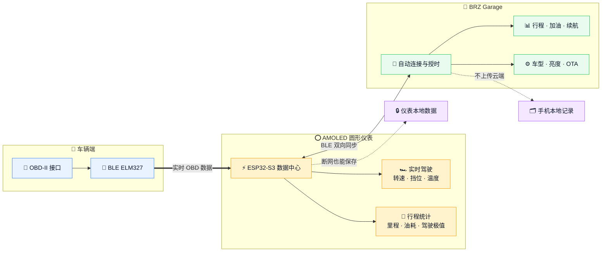
```mermaid
flowchart LR
    subgraph CAR["🚗 车辆端"]
        OBD["🔌 OBD-II 接口"] --> ELM["📡 BLE ELM327"]
    end

    subgraph GAUGE["⭕ AMOLED 圆形仪表"]
        CORE["⚡ ESP32-S3 数据中心"]
        LIVE["🏎️ 实时驾驶<br/>转速 · 挡位 · 温度"]
        TRIP["🧭 行程统计<br/>里程 · 油耗 · 驾驶极值"]
        CORE --> LIVE
        CORE --> TRIP
    end

    subgraph PHONE["📱 BRZ Garage"]
        LINK["🔗 自动连接与授时"]
        REVIEW["📊 行程 · 加油 · 续航"]
        CONTROL["⚙️ 车型 · 亮度 · OTA"]
        LINK --> REVIEW
        LINK --> CONTROL
    end

    ELM ==>|"实时 OBD 数据"| CORE
    CORE <-->|"BLE 双向同步"| LINK
    CORE -.->|"断网也能保存"| NVS["🔒 仪表本地数据"]
    LINK -.->|"不上传云端"| DB["🗂️ 手机本地记录"]

    classDef car fill:#E8F3FF,stroke:#3B82F6,color:#0F172A
    classDef gauge fill:#FFF3CD,stroke:#F59E0B,color:#0F172A
    classDef phone fill:#E9FBEF,stroke:#22C55E,color:#0F172A
    classDef storage fill:#F3E8FF,stroke:#A855F7,color:#0F172A
    class OBD,ELM car
    class CORE,LIVE,TRIP gauge
    class LINK,REVIEW,CONTROL phone
    class NVS,DB storage
```

</details>

> [!IMPORTANT]
> 手机 App 连接的是**仪表**，不是 ELM327。普通 BLE ELM327 通常只允许一个客户端，使用仪表时不要再让 Car Scanner 等 App 同时直连同一个适配器。
>

## 为什么采用 ESP32 + ELM327？

- ✅ **手机无需常驻**：仪表可独立采集 OBD 数据，并暂存待同步行程；
- ✅ **扩展原车信息**：集中展示驾驶、温度、油耗和行程数据；
- ✅ **安装相对简单**：仪表与 BLE ELM327 配合使用，无需改动车辆 ECU。

## 先确认你的设备能用

| 项目 | 当前要求 | 支持状态 |
|---|---|---|
| 车辆 | Subaru BRZ ZD8 6MT | ✅ 已完成实车适配 |
| 车辆 | Subaru BRZ ZC6 6MT | 🧪 已接入，等待更多实车验证 |
| 仪表开发板 | Waveshare ESP32-S3-Touch-AMOLED-1.75 / 1.75-B / 1.75-G（**如需为未来 GPS 扩展预留硬件，请购买 1.75-G 版本**），466×466，16 MB Flash，8 MB PSRAM | ✅ 支持 |
| OBD 适配器 | 支持 BLE 的 ELM327 兼容设备 | ✅ 支持，品质会影响稳定性 |
| 手机 | Android 8.0 或更高版本 | ✅ 支持 |
| 自动挡、其他车型、旧款 1.85 英寸 LCD | — | ❌ 当前用户版不支持 |

如果你的硬件或车型不在表中，请不要直接烧录。源码中保留的历史板型和其他车辆配置，不代表当前版本已经开放或验证。

## 仪表界面预览

| 挡位与转速 | 关键温度 | 油耗信息 |
|:---:|:---:|:---:|
| 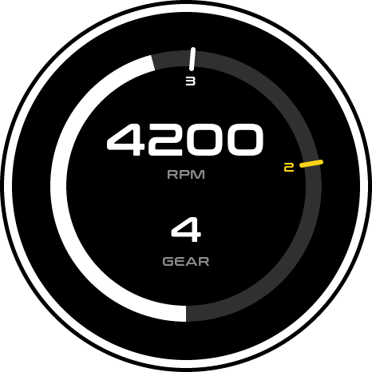 | 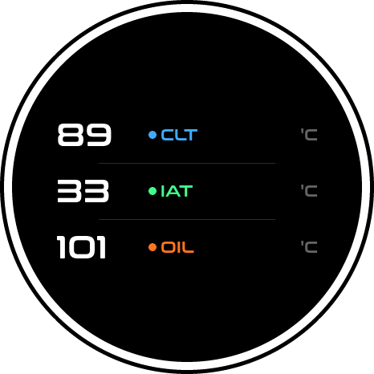 | 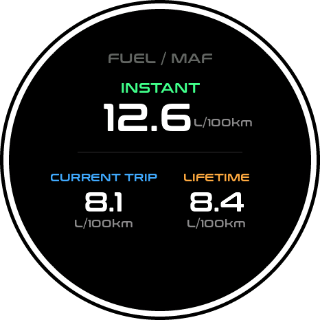 |
| 转速提醒、挡位推算（仅为模拟示意，挡位关系有误） | 水温、进气温、机油温 | 瞬时、本次与累计油耗 |
| **行程总览** | **历史行程** | **转速提醒** |
| 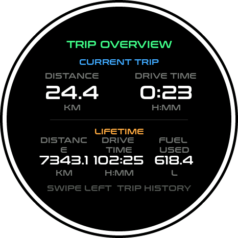 | 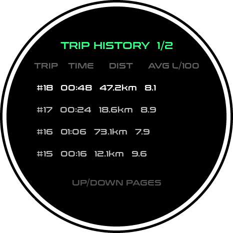 | 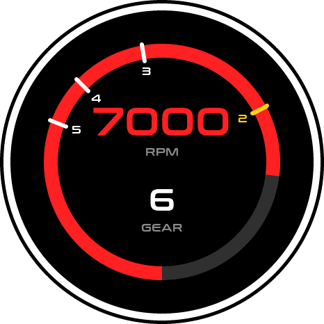 |
| 里程、时间、累计燃油 | 本地保存，断点同步到手机 | 阈值与动画效果预览（实车闪烁提醒仍在优化） |

> 上图由项目自己的 LVGL 模拟器渲染，使用的页面代码和字体资源与固件相同；数值为演示数据。

## App 界面预览（部分展示）

| 车辆首页 | 当前驾驶 | 驾驶足迹 |
|:---:|:---:|:---:|
| 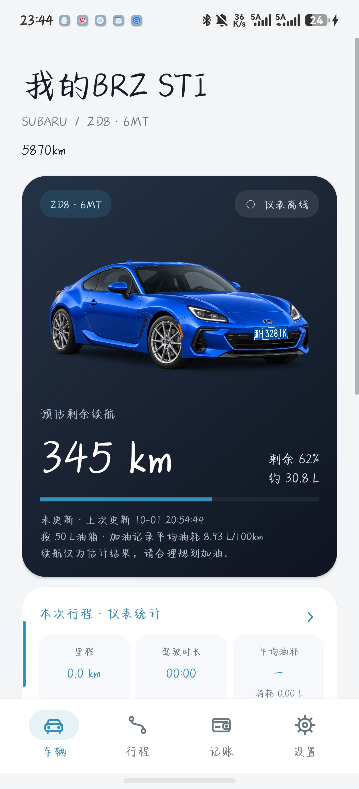 | 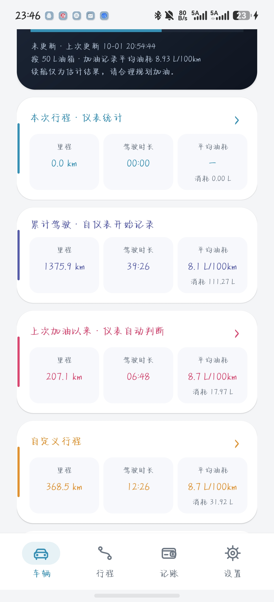 | 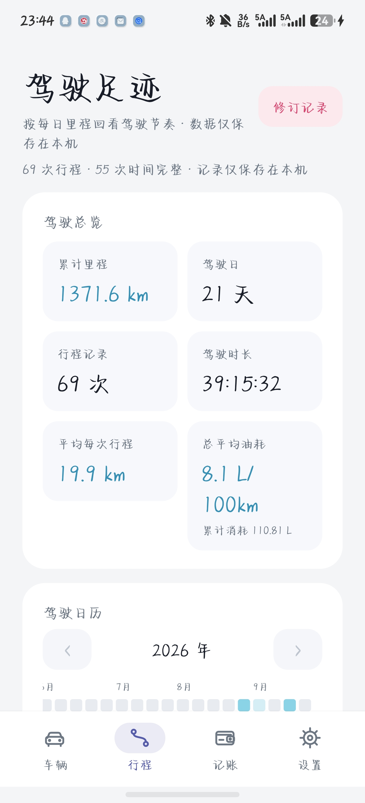 |
| 主页：里程与续航 | 主页：当前行程 | 历史行程 |

| 驾驶详情 | 全能记账 | 设置 |
|:---:|:---:|:---:|
| 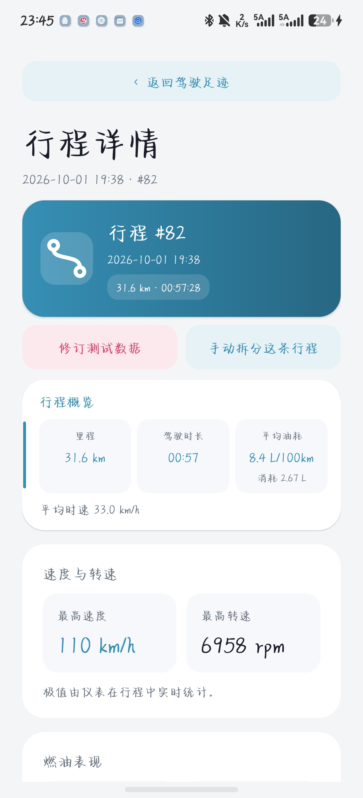 | 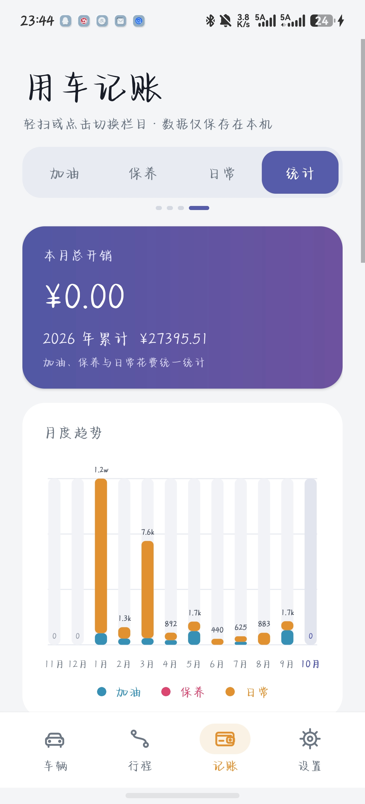 | 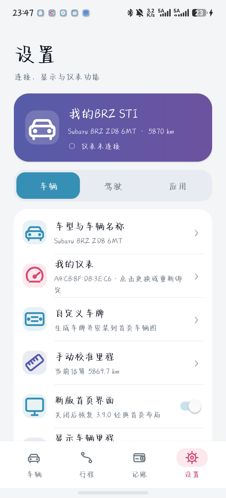 |
| 历史行程详情 | 全能记账 | 车辆、仪表与 OTA 管理 |

> App 预览依据当前 Android 页面结构绘制，使用演示车辆与行程数据；不同系统版本、屏幕尺寸和连接状态下的实际布局与内容可能略有差异。

## 功能全景

| 功能 | 你能获得什么 |
|---|---|
| 🏎️ **实时驾驶仪表** | 显示转速、车速、挡位、水温、进气温、机油温、发动机负荷、节气门、电压和机油压力等关键数据。圆形页面适合快速扫视，左右滑动即可切换。 |
| 🎯 **6MT 驾驶辅助** | 根据转速与车速推算当前挡位；支持自定义转速提醒阈值，高转速闪烁动画仍在优化。OBD 或授时链路异常时会在仪表上明确显示。 |
| 🌡️ **温度与状态监控** | 把水温、进气温和机油温集中在同一页面，也可使用指针或曲线页面观察指定数据的变化趋势。 |
| 🧭 **三种行程视角** | 同时记录“本次行程”“自上次加油”和“自定义行程”的里程、驾驶时间与耗油量；自定义基线同步到仪表后，手机断开也能继续统计。 |
| 🏁 **驾驶回顾** | 每次行程可查看平均时速、最高速度、最高转速、平均油耗、燃油消耗和分行显示的起止时间；行程支持本地修订和手动拆分，旧记录与缺失数据会明确标注。 |
| ⛽ **油量、续航与加油记录** | App 显示剩余油量和估算续航，支持手动加油记录；仪表还能通过两次独立油位样本识别加油事件，识别阈值可在 **5～20 L** 间调节。 |
| 🔧 **保养与维修管理** | 根据项目养护表只追踪实际更换、添加和轮胎换位项目；一次保养可多选，App 会按当前里程推荐项目，也允许增加或移除额外项目。未有历史记录时，首次阈值从 **0 km** 起算。 |
| 📊 **用车记账统计** | 统一记录加油、保养和包含“维修”在内的日常花费；趋势图逐月显示近 12 个月金额，明细则从第一条记录连续展示至今，并提供日常小类别占比。 |
| 🗓️ **清晰的月度归档** | 行程和各类账目按月份分隔，记账月份同时显示记录数量与小计，长时间使用后仍便于查找。 |
| 📱 **自动连接与后台同步** | 绑定后可由系统 BLE 唤醒 App，优先为仪表授时，再同步车辆快照和历史行程；驾驶时常驻通知会直接显示时长与已行驶里程。 |
| 🎛️ **手机端车辆管理** | 在 App 中切换 ZD8/ZC6、调整 10%～100% 日间亮度、校准车辆里程、控制首页卡片，并把设置发送到仪表后回读确认。新版设置按“车辆 / 驾驶 / 应用”归类，应用栏底部保留经典设置入口。 |
| ✨ **统一的新版界面** | 首页、驾驶足迹、记账、设置、详情页和弹窗采用统一的圆角卡片、状态主视觉与导航层级；App 恢复原有系统字体显示方式；新版首页仍可在车辆设置中回退到经典布局。 |
| 💬 **问题反馈** | 在“设置 → 应用”中生成脱敏诊断摘要并打开 [GitHub Issues](https://github.com/sisi4376/BRZ-Garage/issues/new)；提交前可以检查和修改全部内容，也可复制反馈模板，不会自动上传车辆记录、账目或完整蓝牙地址。 |
| ©️ **知情同意与版权** | 首次使用先阅读安全、数据、权限、版权、GPLv3 与非官方声明；分别确认后才会申请系统权限和启动仪表连接，声明可在设置中复查或撤回。 |
| 🔄 **安全无线更新** | 独立固件页提供版本扫描、手动 OTA 与历史版本回滚；App 会检查板型、屏幕、Flash 和双 OTA 分区，并支持断点续传、SHA-256 校验和启动失败自动回滚。 |
| 🔒 **本地优先的数据设计** | 设置、累计统计和未同步行程保存在仪表，历史行程与用车账目保存在手机；日常功能不依赖账号或云服务。 |

## 准备清单

开始前请准备：

- Waveshare ESP32-S3-Touch-AMOLED-1.75、1.75-B 或 1.75-G（目前尚未开发 GPS 功能；如需为未来扩展预留硬件，请选择 1.75-G）；
- 一条确认支持数据传输的 USB 线；
- BLE ELM327 兼容适配器；
- Android 8.0+ 手机；
- Windows 电脑和 [ESP-IDF 5.5+](https://docs.espressif.com/projects/esp-idf/en/latest/esp32s3/get-started/index.html)。

推荐购买链接（仪表尽量购买相同产品，ELM327 类似产品均可）：

- [Waveshare ESP32-S3-Touch-AMOLED-1.75](https://e.tb.cn/h.8xLQrmnxrSXpy9i?tk=vgfbTnGLVRA)
- [ELM327](https://e.tb.cn/h.8xL9TOFCOBy4qnl?tk=XBTFTnGKMOw)

## 第一次安装

### 1. 烧录仪表

#### Windows 一键烧录（免安装开发环境）

在 [GitHub Releases](https://github.com/sisi4376/BRZ-Garage/releases) 对应版本的 **Assets** 中下载 `BRZ-Garage-Flasher-v<固件版本>-r<工具修订>-Windows-x64.zip`（及同名 `.zip.sha256` 校验文件）。每次发布 Beta / 正式版后自动构建、测试并附加烧录包；附件需等待发布工作流成功完成。下载完整烧录包后：

1. 将 ZIP **完整解压**，用 USB 数据线连接仪表。
2. 双击 `Start-Flasher.cmd`，等待自动识别 USB 串口并确认开发板型号。工具每 2 秒监测插拔、显示设备名称并排除蓝牙虚拟串口；多个 USB 候选设备需要手动选择。
3. 新板或原厂/其他固件勾选“首次安装”，已有 BRZ 仪表重装通常不用勾选。
4. 点击“开始烧录”，查看实时备份百分比、已读取容量和耗时，等待写入、校验与重启完成。写入时显示当前分区进度，不代表整次操作已完成。

支持 Windows 10/11 x64，无需安装 Python、ESP-IDF 或编译工具。工具先核验固件、检查 ESP32-S3 和 16 MB Flash，再完整备份原始 Flash；不执行整片擦除。同分区 BRZ 固件普通重装保留 NVS 数据和开机动画。具体开发板型号仍需人工确认，不能只凭芯片型号判断兼容。

备份和日志位于 `%LOCALAPPDATA%\BRZ-Garage\Flasher\backups\`，可在界面中直接打开。备份包含设备与行程数据，请妥善保存。维护者的打包命令及验证方式见 [烧录包说明](firmware/README.md)。

#### 从源码构建并烧录（开发者）

如果电脑尚未安装该环境，请先按照乐鑫官方的 [ESP-IDF 5.5.2 Windows 工具链安装说明](https://docs.espressif.com/projects/esp-idf/en/v5.5.2/esp32s3/get-started/windows-setup.html) 完成安装，并在安装结束时选择 **Run ESP-IDF PowerShell Environment**。**ESP-IDF PowerShell** 不是需要单独下载的软件，而是安装器创建的、已经配置好 ESP-IDF 环境变量的 PowerShell 入口。

从开始菜单打开 **ESP-IDF PowerShell**。不要使用普通 PowerShell，因为其中通常没有配置 `idf.py` 和 `esptool.py`。

先确认工具可用：

```powershell
idf.py --version
esptool.py version
```

用 USB 连接仪表，然后查看串口：

```powershell
[System.IO.Ports.SerialPort]::GetPortNames()
```

进入项目目录，将 `COM5` 换成你的实际串口，只运行下面这条推荐命令：

```powershell
cd C:\path\to\BRZ_OBD
.\tools\flash_gauge.ps1 -Port COM5 -Board AMOLED_175
```

脚本会检查板型、备份原有配置、编译当前固件并烧录。确认屏幕上的串口和板型无误后，按提示输入大写 `FLASH`。

> [!WARNING]
> 不要运行 `erase_flash` 或 `idf.py erase-flash`。整片擦除会删除 ELM327 配对、车型、主题、累计油耗和未同步行程。推荐脚本不会执行整片擦除。

烧录成功后，仪表会自动复位并显示启动画面。配置备份保存在 `backups/manual/`，确认设备正常前请勿删除。

<details>
<summary><b>一直停在 Connecting… 怎么办？</b></summary>

1. 关闭串口监视器、IDE 和其他可能占用串口的软件。
2. 按住开发板的 `BOOT` 键。
3. 短按并松开 `RESET/RST`。
4. 松开 `BOOT`。
5. 重新执行同一条烧录命令。

</details>

### 2. 安装 BRZ Garage

前往 [v4.3.6 Beta 公测版](https://github.com/sisi4376/BRZ-Garage/releases/tag/v4.3.6) 下载并安装 **BRZ Garage**。完成第一次烧录后，App 和仪表固件的后续升级都可以直接在 App 内完成。

- 覆盖安装新版 APK 即可保留历史数据，**不要先卸载旧版**；
- 首次启动先阅读并分别确认安全/数据与版权/许可声明；确认前 App 不会申请权限、连接仪表或启动后台服务；
- 授予“附近设备”、通知，以及 Android 13+ 的附近 Wi-Fi 权限；
- 如果系统提示未知来源安装，只应对从本仓库下载的 APK 临时授权；
- 华为/鸿蒙手机还需要允许自启动、关联启动和后台活动，并关闭电池优化。

### 3. 连接车辆

1. 将 ELM327 插入车辆 OBD-II 接口，启动车辆，或让 ECU 保持可响应状态。
2. 打开仪表的 BLE 扫描页，选择你自己的 ELM327。
3. 在 App 的“设置 → 车辆”中绑定名称以 `SkyGauge` 开头的仪表，并按系统提示确认伴生设备关联。
4. 进入“仪表设置”，选择 `BRZ ZD8 6MT` 或 `BRZ ZC6 6MT`。
5. 点击“保存并同步车型”，等待 App 显示已经由仪表回读确认。
6. 回到仪表页，确认转速、车速和温度开始刷新。

> [!TIP]
> 仪表断电后需要手机重新授时。建议打开 App 的“开机自启 / 自动连接”，并在“设置 → 应用 → 系统级 BLE 唤醒”确认系统伴生关联有效。

## 日常使用

仪表页面以手势切换：左右滑动浏览挡位、车速、温度、信息、指针、曲线、油耗和行程页面；部分页面上下滑动可进入对应设置。驾驶时请不要操作触摸屏。

常用功能一览：

- **实时数据**：转速、车速、水温、进气温、机油温、负荷、节气门、电压等；
- **驾驶辅助**：6MT 挡位推算、转速提醒和数据断开提示；
- **油耗与里程**：本次/累计油耗、行程里程、驾驶时间和估算里程；
- **行程回顾**：在 App 中查看历史行程的速度、转速、油耗和起止时间，必要时可修订或手动拆分，记录按月份清晰分隔；
- **保养管理**：按里程快捷勾选本次更换项目，一次保存多个项目，并保留手动增减能力；
- **用车记账**：记录加油、保养、维修和其他日常花费，查看近 12 个月趋势及从首条记录开始的完整月度明细；
- **车辆管理**：在 App 中切换 ZD8/ZC6、调整 10%～100% 日间亮度、校准车辆里程并记录加油；
- **本地数据**：仪表和 App 的记录保存在本机，不上传云端。

如果仪表在熄火后仍持续供电，它会在连续 **15 分钟**没有恢复有效 RPM 后结束并保存当前行程；15 分钟内再次启动会继续记录为同一次行程。若仪表随车辆一起断电，断电期间无法继续计时，当前行程会先保存为待结算状态，待下次通电并取得可靠的手机时间后完成归档和同步。因此，熄火后 App 不一定会立即显示刚结束的行程。

> [!NOTE]
> 覆盖安装新版 APK 会保留 App 本地记录；卸载 App 或清除应用数据会删除手机端的行程、加油、保养、维修和记账数据。仪表只保留有限的滚动历史与待同步队列，不能替代手机端数据备份。

## 用 App 更新仪表固件

1. 停车并保持仪表稳定供电。
2. 打开“设置 → 应用 → 仪表固件更新”。
3. 点击“扫描是否需要更新”。扫描只读取设备信息，不会立即更新。
4. 通过兼容性检查后，点击“手动进入 OTA 并更新”。
5. 阅读并完成二次驻车确认，等待传输、校验和自动重启。

如需回退，使用同一页面的“选择历史版本回滚”；回滚同样必须停车、保持稳定供电并完成风险确认。

更新时 App 会校验仪表型号、屏幕、Flash、双 OTA 分区和文件 SHA-256。传输短暂中断时会尝试断点续传；新固件无法正常启动时，引导程序会自动回滚。NVS 设置、累计统计、未同步行程和开机媒体不会被主动擦除。

> [!CAUTION]
> 固件检查和更新可能暂停 OBD 采集与行程记录。严禁在行驶中使用这些功能。

<!-- 暂时隐藏：常见问题

## 常见问题

| 现象 | 优先检查 |
|---|---|
| 找不到串口 | 更换确认支持数据的 USB 线；换 USB 口；重新插拔后比较端口列表 |
| 烧录卡在 `Connecting...` | 关闭占用串口的软件，并按上面的 BOOT/RESET 步骤进入下载模式 |
| 仪表找不到 ELM327 | 确认适配器是 BLE 而不是经典蓝牙/Wi-Fi；让车辆 ECU 保持唤醒 |
| App 找不到仪表 | 给 App“附近设备”权限；打开系统蓝牙；确认仪表已正常启动 |
| OBD 连接后没有数据 | 关闭其他直连 ELM327 的 App；重新上电；查看 [OBD 故障排查](docs/OBD_TROUBLESHOOTING.md) |
| App 无法自动重连 | 重新打开 App 一次；解除“强行停止”；允许自启动和后台活动 |
| 部分数据一直无效 | 低价 ELM327 可能缺少命令或刷新过慢；不同年款/市场 ECU 也可能存在差异 |

-->

## 当前边界

- ZD8 6MT 是目前唯一完成实车验证的车型；ZC6 6MT 已实现单路 OBD/PID 和 FA20 Toyota Mode 21 机油温度读取，但仍需要更多实车验证。
- 挡位、油耗、里程和加减速度是推算结果，只适合驾驶回顾，不能替代原厂仪表或专业诊断设备。
- MultiGauge 设置目前固定为 `MASTER / POS 1 / VIDEO`；相关页面保留，但不可修改。
- 行程合并间隔固定为 15 分钟；旧 NVS 中的其他车型会归一为 ZD8。
- App OTA 只允许硬件清单完全匹配的 AMOLED 1.75-B 仪表。
- 本项目不是安全关键设备。不要把显示结果作为维修或驾驶安全决策的唯一依据。

<!-- 暂时隐藏：更多文档

## 更多文档

| 想了解的内容 | 文档 |
|---|---|
| OBD 无数据、断线或 PID 异常 | [OBD 故障排查](docs/OBD_TROUBLESHOOTING.md) |
| 车型选择和参数 | [车辆配置](docs/VEHICLE_CONFIG.md) |
| ZD8 协议与挡位策略 | [ZD8 协议指南](docs/BRZ_ZD8_PROTOCOL_GUIDE.md) · [挡位策略](docs/BRZ_ZD8_GEAR_STRATEGY.md) |
| 油耗如何计算 | [油耗计算说明](docs/FUEL_CALCULATION.md) |
| App 与行程同步 | [App 集成](docs/APP_INTEGRATION.md) · [行程 BLE 同步](docs/TRIP_BLE_SYNC.md) |
| 不烧录预览界面 | [浏览器预览](preview/README.md) · [原生模拟器](simulator/README.md) |
| 主题制作 | [主题系统](docs/THEMING.md) · [主题模板](themes/README.md) |
| 完整版本历史 | [CHANGELOG](CHANGELOG.md) |

开发者可从 [中文技术说明](docs/README.zh-CN.md) 或 [English README](docs/README.en.md) 开始了解目录结构、模拟器、车辆协议和移植细节。

-->

## 版权、致谢与许可

本项目基于 [steveEcode/obd_brz_gauge](https://github.com/steveEcode/obd_brz_gauge) 二次开发，该项目为本项目的仪表实现和硬件适配提供了重要基础与参考。

同时感谢 [zhaizhaitao/open_obd_dsp](https://github.com/zhaizhaitao/open_obd_dsp) 开源的原始仪表方案、[timurrrr/ft86](https://github.com/timurrrr/ft86) 整理的 FT86/BRZ CAN 资料，以及 [Hokori23](https://github.com/Hokori23) 提供的 NVS、页面刷新和 OBD 轮询性能建议。

本仓库当前采用 [GNU General Public License v3.0](LICENSE) 发布。允许使用、修改和分发；分发修改版本时必须继续按照 GPLv3 提供对应源代码。版权归属按组件区分：

```text
上游仪表代码：Copyright (C) 2024-2026 steveEcode and contributors
仪表修改部分：Copyright (C) 2026 sisi4376
Android App：Copyright (C) 2026 sisi4376
```

本仓库包含 sisi4376 于 2026 年对上游仪表项目所作的修改，以及独立新增的 BRZ Garage Android App。原作者对上游代码的版权不会因本项目的修改而转移；sisi4376 对自行完成的仪表修改和 Android App 代码分别主张版权。

第三方组件和素材继续适用其各自的许可证与版权声明。更完整的组件归属、内置固件说明和非官方声明请参阅 [NOTICE](NOTICE.md)。
